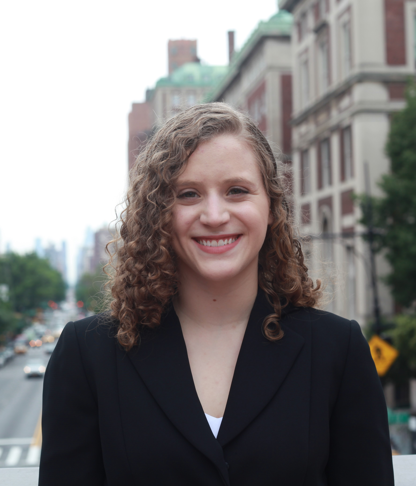

# About Me:

My research interests include translational science and technology that drive medical knowledge, treatment and device development. I currently work in the [Kasza Living Material Lab](https://http://www.kaszalab.com) at Columbia University, investigating the role of mechanical forces in embryonic development.

I graduated from a combined proram with a BS in Mechanical Engineering from Columbia University and a BA in Physics from Clark University in 2018. I will graduate with my MS in Mechnical Engineering in December 2019 and continue in the MS/PhD program at Columbia University. 

I am a second year MS/PhD candidate at Columbia University with a longstanding interest in medical research and technology.

My full CV is available [here](resume.html).